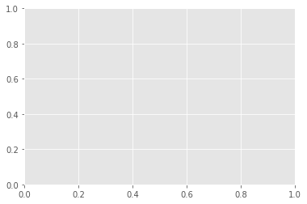
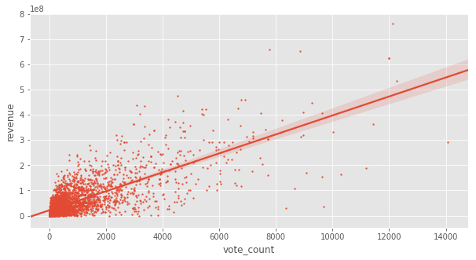
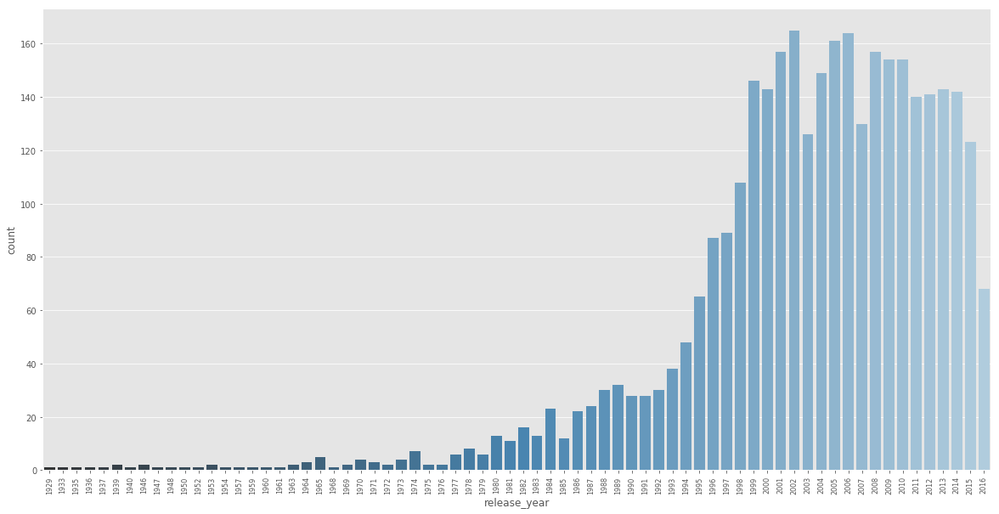
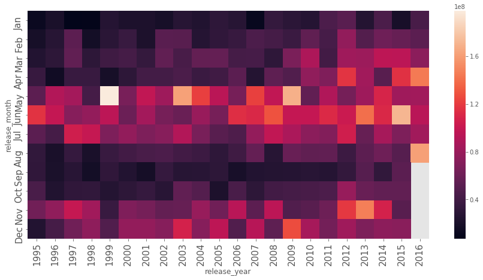
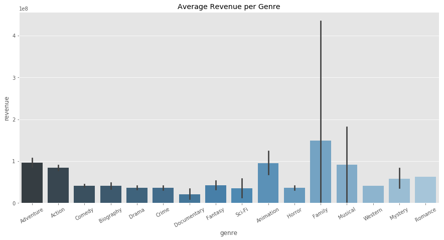
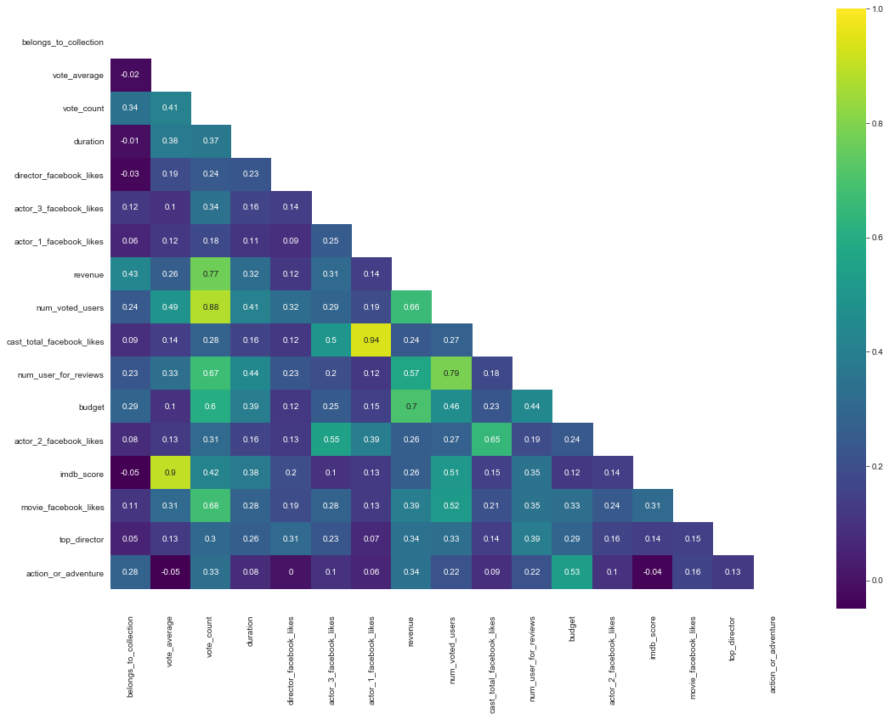
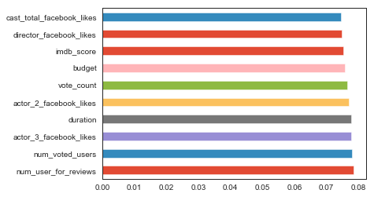
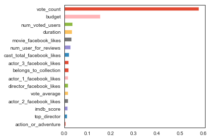
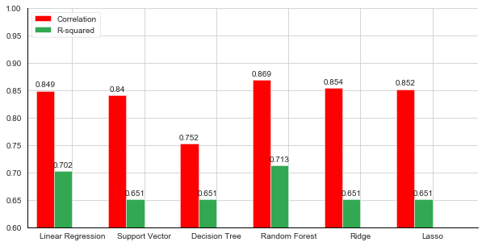
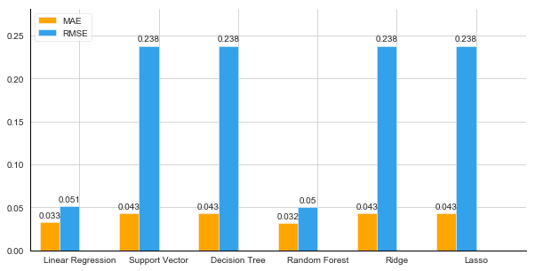

# Initialization


```python
import pandas as pd
from datetime import datetime
import numpy as np
from numpy import sqrt
import seaborn as sns
import matplotlib.pyplot as plt
import matplotlib.style as style
from ast import literal_eval
from sklearn.preprocessing import OneHotEncoder, LabelEncoder
from sklearn.linear_model import LinearRegression
from sklearn.preprocessing import StandardScaler
from sklearn.preprocessing import power_transform
from sklearn.model_selection import train_test_split, cross_val_score, cross_val_predict
from sklearn import metrics
from sklearn.metrics import r2_score, mean_squared_error, mean_absolute_error
from sklearn.svm import SVR
from sklearn.tree import DecisionTreeRegressor
import statsmodels.api as sm
import statsmodels
import statsmodels.stats.api as sms
from statsmodels.stats.diagnostic import het_white
from statsmodels.compat import lzip
from sklearn.utils import check_array
from scipy import stats
from scipy.special import boxcox1p
from tqdm import tqdm_notebook
from sklearn.model_selection import validation_curve
from sklearn.preprocessing import PolynomialFeatures
from sklearn.linear_model import LinearRegression
from sklearn.pipeline import make_pipeline

%matplotlib inline
#style.use('seaborn-poster') #sets the size of the charts
style.use('ggplot')

#!sudo apt-get install python-sklearn

import warnings
warnings.filterwarnings('ignore')
```


```python
movies1 = pd.read_csv('movies_metadata.csv')
movies2 = pd.read_csv('movie_metadata.csv')
```

# Data Cleaning & Preprocessing


```python
print(movies1.shape)
print(movies2.shape)
```

    (45466, 24)
    (5043, 28)
    


```python
movies1.head(1)
```


<div>
<style scoped>
    .dataframe tbody tr th:only-of-type {
        vertical-align: middle;
    }

    .dataframe tbody tr th {
        vertical-align: top;
    }

    .dataframe thead th {
        text-align: right;
    }
</style>
<table border="1" class="dataframe">
  <thead>
    <tr style="text-align: right;">
      <th></th>
      <th>adult</th>
      <th>belongs_to_collection</th>
      <th>budget</th>
      <th>genres</th>
      <th>homepage</th>
      <th>id</th>
      <th>imdb_id</th>
      <th>original_language</th>
      <th>original_title</th>
      <th>overview</th>
      <th>...</th>
      <th>release_date</th>
      <th>revenue</th>
      <th>runtime</th>
      <th>spoken_languages</th>
      <th>status</th>
      <th>tagline</th>
      <th>title</th>
      <th>video</th>
      <th>vote_average</th>
      <th>vote_count</th>
    </tr>
  </thead>
  <tbody>
    <tr>
      <th>0</th>
      <td>False</td>
      <td>{'id': 10194, 'name': 'Toy Story Collection', ...</td>
      <td>30000000</td>
      <td>[{'id': 16, 'name': 'Animation'}, {'id': 35, '...</td>
      <td>http://toystory.disney.com/toy-story</td>
      <td>862</td>
      <td>tt0114709</td>
      <td>en</td>
      <td>Toy Story</td>
      <td>Led by Woody, Andy's toys live happily in his ...</td>
      <td>...</td>
      <td>1995-10-30</td>
      <td>373554033.0</td>
      <td>81.0</td>
      <td>[{'iso_639_1': 'en', 'name': 'English'}]</td>
      <td>Released</td>
      <td>NaN</td>
      <td>Toy Story</td>
      <td>False</td>
      <td>7.7</td>
      <td>5415.0</td>
    </tr>
  </tbody>
</table>
<p>1 rows × 24 columns</p>
</div>


```python
movies2.head(1)
```


<div>
<style scoped>
    .dataframe tbody tr th:only-of-type {
        vertical-align: middle;
    }

    .dataframe tbody tr th {
        vertical-align: top;
    }

    .dataframe thead th {
        text-align: right;
    }
</style>
<table border="1" class="dataframe">
  <thead>
    <tr style="text-align: right;">
      <th></th>
      <th>color</th>
      <th>director_name</th>
      <th>num_critic_for_reviews</th>
      <th>duration</th>
      <th>director_facebook_likes</th>
      <th>actor_3_facebook_likes</th>
      <th>actor_2_name</th>
      <th>actor_1_facebook_likes</th>
      <th>gross</th>
      <th>genres</th>
      <th>...</th>
      <th>num_user_for_reviews</th>
      <th>language</th>
      <th>country</th>
      <th>content_rating</th>
      <th>budget</th>
      <th>title_year</th>
      <th>actor_2_facebook_likes</th>
      <th>imdb_score</th>
      <th>aspect_ratio</th>
      <th>movie_facebook_likes</th>
    </tr>
  </thead>
  <tbody>
    <tr>
      <th>0</th>
      <td>Color</td>
      <td>James Cameron</td>
      <td>723.0</td>
      <td>178.0</td>
      <td>0.0</td>
      <td>855.0</td>
      <td>Joel David Moore</td>
      <td>1000.0</td>
      <td>760505847.0</td>
      <td>Action|Adventure|Fantasy|Sci-Fi</td>
      <td>...</td>
      <td>3054.0</td>
      <td>English</td>
      <td>USA</td>
      <td>PG-13</td>
      <td>237000000.0</td>
      <td>2009.0</td>
      <td>936.0</td>
      <td>7.9</td>
      <td>1.78</td>
      <td>33000</td>
    </tr>
  </tbody>
</table>
<p>1 rows × 28 columns</p>
</div>


Both datasets are amazing but one is massive compared to another. I want to know if I should combine both to get more features but lesser samples which could possibly increase accuracy, or should I use the dataset with 40k and rely on training samples alone. I'll try the former option first.


```python
movies2['imdb_id'] = movies2['movie_imdb_link'].apply(lambda x: x.split('/')[4])
movies = pd.merge(left = movies1, right = movies2, left_on = 'imdb_id', right_on = 'imdb_id')
```

Since I'm using two datasets, there are overlapping features. I will discard the redundants with lesser data. For example, if one dataset has more genre specification than the other, I will prefer it more. 

Removing null values:


```python
movies.head(1)
```


<div>
<style scoped>
    .dataframe tbody tr th:only-of-type {
        vertical-align: middle;
    }

    .dataframe tbody tr th {
        vertical-align: top;
    }

    .dataframe thead th {
        text-align: right;
    }
</style>
<table border="1" class="dataframe">
  <thead>
    <tr style="text-align: right;">
      <th></th>
      <th>adult</th>
      <th>belongs_to_collection</th>
      <th>budget_x</th>
      <th>genres_x</th>
      <th>homepage</th>
      <th>id</th>
      <th>imdb_id</th>
      <th>original_language</th>
      <th>original_title</th>
      <th>overview</th>
      <th>...</th>
      <th>num_user_for_reviews</th>
      <th>language</th>
      <th>country</th>
      <th>content_rating</th>
      <th>budget_y</th>
      <th>title_year</th>
      <th>actor_2_facebook_likes</th>
      <th>imdb_score</th>
      <th>aspect_ratio</th>
      <th>movie_facebook_likes</th>
    </tr>
  </thead>
  <tbody>
    <tr>
      <th>0</th>
      <td>False</td>
      <td>{'id': 10194, 'name': 'Toy Story Collection', ...</td>
      <td>30000000</td>
      <td>[{'id': 16, 'name': 'Animation'}, {'id': 35, '...</td>
      <td>http://toystory.disney.com/toy-story</td>
      <td>862</td>
      <td>tt0114709</td>
      <td>en</td>
      <td>Toy Story</td>
      <td>Led by Woody, Andy's toys live happily in his ...</td>
      <td>...</td>
      <td>391.0</td>
      <td>English</td>
      <td>USA</td>
      <td>G</td>
      <td>30000000.0</td>
      <td>1995.0</td>
      <td>1000.0</td>
      <td>8.3</td>
      <td>1.85</td>
      <td>0</td>
    </tr>
  </tbody>
</table>
<p>1 rows × 52 columns</p>
</div>


```python
print(movies['genres_x'].fillna('[]').apply(literal_eval).apply(lambda x: len([i['name'] for i in x]) if isinstance(x, list) else []).mean())
print(movies['genres_y'].apply(lambda x: len(x.split("|"))).mean())
```

    2.5678881592882865
    2.9112476170302903
    

As evident from above, the genre feature from the second dataset has more data, so I will discard the genre column from the first. I'm not sure if this will help increase the prediction accuracy in anyway, but I'll give it a shot.

Also going to be taking only one genre from the list of genres. This will of course decrease accuracy but I don't know how to incorporate multiple genres into my algorithm. I could one-hot encode them, but that would mean my algorithm would give preference to movies with more listed genres, which is not an indicator of success. 


```python
movies['genre'] = movies['genres_y'].apply(lambda x: x.split("|")[0])
```


```python
movies['genre'].unique()
```


    array(['Adventure', 'Action', 'Comedy', 'Biography', 'Drama', 'Crime',
           'Documentary', 'Fantasy', 'Sci-Fi', 'Animation', 'Horror',
           'Film-Noir', 'Family', 'Western', 'Thriller', 'Musical', 'Mystery',
           'Romance', 'Music'], dtype=object)


```python
movies.shape
```


    (4721, 53)


```python
'''
one_hot_genres = pd.get_dummies(movies['genre'], prefix = 'category')
one_hot_genre_cols = one_hot_genres.columns
movies = pd.concat([movies, one_hot_genres], axis=1, sort = False)
'''
```


    "\none_hot_genres = pd.get_dummies(movies['genre'], prefix = 'category')\none_hot_genre_cols = one_hot_genres.columns\nmovies = pd.concat([movies, one_hot_genres], axis=1, sort = False)\n"


Another thing that I notice is discrepancies between similar columns, for example the gross/revenue. They seem to differ by a lot. How much? We'll find out. 


```python
(abs(movies['revenue'] - movies['gross']) / (movies['revenue'] + movies['gross']) * 100).mean()
```


    43.07130868751626


43% difference. No thank you. After doing a bit of digging around, I find that the dataset movies2 contained movie revenue for USA alone, while movies1 has the global revenue. What I want is the former, so I will discard the 'revenue' column from movie1 and keep 'gross'.

There's another interesting column, 'belongs_to_collection'. I will binarize, as it makes sense as to conclude that a movie will earn more if it belongs to a collection.


```python
movies['belongs_to_collection'] = movies['belongs_to_collection'].apply(lambda x: 0 if pd.isna(x) else 1)
```

Converting to datetime format for convenience.


```python
months = ['Placeholder', 'Jan', 'Feb', 'Mar', 'Apr', 'May', 'Jun', 'Jul', 'Aug', 'Sep', 'Oct', 'Nov', 'Dec']
movies['release_date'] = movies['release_date'].apply(lambda x: datetime.strptime(x, '%Y-%m-%d'))
movies['release_month'] = movies['release_date'].apply(lambda x: months[x.month])
movies['release_year'] = movies['release_date'].apply(lambda x: x.year)

```

Converting to lists:


```python
movies['production_companies'] = movies['production_companies'].fillna('[]').apply(literal_eval).apply(lambda x: [i['name'] for i in x] if isinstance(x, list) else [])
movies['production_countries'] = movies['production_countries'].fillna('[]').apply(literal_eval).apply(lambda x: [i['name'] for i in x] if isinstance(x, list) else [])
movies['spoken_languages'] = movies['spoken_languages'].fillna('[]').apply(literal_eval).apply(lambda x: [i['name'] for i in x] if isinstance(x, list) else [])
```

Plot keywords will help a ton in building movie recommendation systems, but the goal here is to predict the profit of a movie. So it's of no use here. 


```python
columns_to_drop = ['revenue', 'movie_imdb_link', 'genres_x', 'genres_y', 'homepage', 'id', 'imdb_id', 'overview', 
                   'poster_path', 'status', 'tagline', 'movie_title', 'original_language', 'original_title', 'video',
                  'budget_x', 'language', 'country', 'adult', 'plot_keywords', 'aspect_ratio', 'runtime', 'title_year']
                   
movies = movies.drop(columns_to_drop, axis = 1).rename(columns = {'budget_y' : 'budget', 'gross' : 'revenue'})
```


```python
movies = movies[movies['production_countries'].apply(lambda x: True if 'United States of America' in x else False)]
movies = movies[movies['spoken_languages'].apply(lambda x: True if 'English' in x else False)]
```


```python
movies.median()
```


    belongs_to_collection        0.000000e+00
    popularity                   8.754132e+00
    vote_average                 6.200000e+00
    vote_count                   3.350000e+02
    num_critic_for_reviews       1.250000e+02
    duration                     1.050000e+02
    director_facebook_likes      5.700000e+01
    actor_3_facebook_likes       4.345000e+02
    actor_1_facebook_likes       1.000000e+03
    revenue                      3.240374e+07
    num_voted_users              4.622100e+04
    cast_total_facebook_likes    3.924000e+03
    facenumber_in_poster         1.000000e+00
    num_user_for_reviews         1.910000e+02
    budget                       2.300000e+07
    actor_2_facebook_likes       6.800000e+02
    imdb_score                   6.500000e+00
    movie_facebook_likes         2.090000e+02
    release_year                 2.005000e+03
    dtype: float64


```python
print(movies.shape)
movies = movies.dropna()
#movies = movies.fillna(movies.median())
print(movies.shape)
```

    (3943, 32)
    (3358, 32)
    

# Exploratory Data Analysis & Feature Selection


```python
movies.info()
```

    <class 'pandas.core.frame.DataFrame'>
    Int64Index: 3358 entries, 0 to 4713
    Data columns (total 32 columns):
    belongs_to_collection        3358 non-null int64
    popularity                   3358 non-null object
    production_companies         3358 non-null object
    production_countries         3358 non-null object
    release_date                 3358 non-null datetime64[ns]
    spoken_languages             3358 non-null object
    title                        3358 non-null object
    vote_average                 3358 non-null float64
    vote_count                   3358 non-null float64
    color                        3358 non-null object
    director_name                3358 non-null object
    num_critic_for_reviews       3358 non-null float64
    duration                     3358 non-null float64
    director_facebook_likes      3358 non-null float64
    actor_3_facebook_likes       3358 non-null float64
    actor_2_name                 3358 non-null object
    actor_1_facebook_likes       3358 non-null float64
    revenue                      3358 non-null float64
    actor_1_name                 3358 non-null object
    num_voted_users              3358 non-null int64
    cast_total_facebook_likes    3358 non-null int64
    actor_3_name                 3358 non-null object
    facenumber_in_poster         3358 non-null float64
    num_user_for_reviews         3358 non-null float64
    content_rating               3358 non-null object
    budget                       3358 non-null float64
    actor_2_facebook_likes       3358 non-null float64
    imdb_score                   3358 non-null float64
    movie_facebook_likes         3358 non-null int64
    genre                        3358 non-null object
    release_month                3358 non-null object
    release_year                 3358 non-null int64
    dtypes: datetime64[ns](1), float64(13), int64(5), object(13)
    memory usage: 865.7+ KB
    


```python
movies.describe().shape
```


    (8, 18)


```python
movies.describe()
```


<div>
<style scoped>
    .dataframe tbody tr th:only-of-type {
        vertical-align: middle;
    }

    .dataframe tbody tr th {
        vertical-align: top;
    }

    .dataframe thead th {
        text-align: right;
    }
</style>
<table border="1" class="dataframe">
  <thead>
    <tr style="text-align: right;">
      <th></th>
      <th>belongs_to_collection</th>
      <th>vote_average</th>
      <th>vote_count</th>
      <th>num_critic_for_reviews</th>
      <th>duration</th>
      <th>director_facebook_likes</th>
      <th>actor_3_facebook_likes</th>
      <th>actor_1_facebook_likes</th>
      <th>revenue</th>
      <th>num_voted_users</th>
      <th>cast_total_facebook_likes</th>
      <th>facenumber_in_poster</th>
      <th>num_user_for_reviews</th>
      <th>budget</th>
      <th>actor_2_facebook_likes</th>
      <th>imdb_score</th>
      <th>movie_facebook_likes</th>
      <th>release_year</th>
    </tr>
  </thead>
  <tbody>
    <tr>
      <th>count</th>
      <td>3358.000000</td>
      <td>3358.000000</td>
      <td>3358.000000</td>
      <td>3358.000000</td>
      <td>3358.000000</td>
      <td>3358.000000</td>
      <td>3358.000000</td>
      <td>3358.000000</td>
      <td>3.358000e+03</td>
      <td>3.358000e+03</td>
      <td>3358.000000</td>
      <td>3358.000000</td>
      <td>3358.000000</td>
      <td>3.358000e+03</td>
      <td>3358.000000</td>
      <td>3358.000000</td>
      <td>3358.000000</td>
      <td>3358.000000</td>
    </tr>
    <tr>
      <th>mean</th>
      <td>0.250744</td>
      <td>6.190887</td>
      <td>954.145920</td>
      <td>169.294223</td>
      <td>110.233770</td>
      <td>860.966647</td>
      <td>824.218285</td>
      <td>8135.464562</td>
      <td>5.732073e+07</td>
      <td>1.104946e+05</td>
      <td>12190.299285</td>
      <td>1.414532</td>
      <td>351.083681</td>
      <td>4.103701e+07</td>
      <td>2171.393985</td>
      <td>6.407058</td>
      <td>9568.661108</td>
      <td>2003.037522</td>
    </tr>
    <tr>
      <th>std</th>
      <td>0.433506</td>
      <td>0.882913</td>
      <td>1448.036597</td>
      <td>124.773653</td>
      <td>22.353895</td>
      <td>3209.121228</td>
      <td>1973.656712</td>
      <td>15538.326953</td>
      <td>7.243680e+07</td>
      <td>1.567349e+05</td>
      <td>19333.196884</td>
      <td>2.099191</td>
      <td>423.934717</td>
      <td>4.410129e+07</td>
      <td>4729.843994</td>
      <td>1.055894</td>
      <td>21847.848698</td>
      <td>9.846291</td>
    </tr>
    <tr>
      <th>min</th>
      <td>0.000000</td>
      <td>0.000000</td>
      <td>0.000000</td>
      <td>1.000000</td>
      <td>37.000000</td>
      <td>0.000000</td>
      <td>0.000000</td>
      <td>0.000000</td>
      <td>1.620000e+02</td>
      <td>1.030000e+02</td>
      <td>0.000000</td>
      <td>0.000000</td>
      <td>6.000000</td>
      <td>2.180000e+02</td>
      <td>0.000000</td>
      <td>1.600000</td>
      <td>0.000000</td>
      <td>1929.000000</td>
    </tr>
    <tr>
      <th>25%</th>
      <td>0.000000</td>
      <td>5.700000</td>
      <td>138.000000</td>
      <td>78.000000</td>
      <td>96.000000</td>
      <td>11.000000</td>
      <td>230.250000</td>
      <td>807.250000</td>
      <td>1.220310e+07</td>
      <td>2.138275e+04</td>
      <td>2172.250000</td>
      <td>0.000000</td>
      <td>116.000000</td>
      <td>1.200000e+07</td>
      <td>435.250000</td>
      <td>5.800000</td>
      <td>0.000000</td>
      <td>1999.000000</td>
    </tr>
    <tr>
      <th>50%</th>
      <td>0.000000</td>
      <td>6.200000</td>
      <td>416.000000</td>
      <td>140.000000</td>
      <td>106.000000</td>
      <td>65.000000</td>
      <td>462.500000</td>
      <td>2000.000000</td>
      <td>3.395762e+07</td>
      <td>5.703900e+04</td>
      <td>4529.000000</td>
      <td>1.000000</td>
      <td>217.000000</td>
      <td>2.600000e+07</td>
      <td>723.000000</td>
      <td>6.500000</td>
      <td>245.000000</td>
      <td>2004.000000</td>
    </tr>
    <tr>
      <th>75%</th>
      <td>1.000000</td>
      <td>6.800000</td>
      <td>1120.500000</td>
      <td>226.000000</td>
      <td>120.000000</td>
      <td>241.000000</td>
      <td>719.750000</td>
      <td>13000.000000</td>
      <td>7.266003e+07</td>
      <td>1.353745e+05</td>
      <td>16962.500000</td>
      <td>2.000000</td>
      <td>417.500000</td>
      <td>5.500000e+07</td>
      <td>1000.000000</td>
      <td>7.100000</td>
      <td>11000.000000</td>
      <td>2010.000000</td>
    </tr>
    <tr>
      <th>max</th>
      <td>1.000000</td>
      <td>9.300000</td>
      <td>14075.000000</td>
      <td>813.000000</td>
      <td>330.000000</td>
      <td>23000.000000</td>
      <td>23000.000000</td>
      <td>640000.000000</td>
      <td>7.605058e+08</td>
      <td>1.689764e+06</td>
      <td>656730.000000</td>
      <td>43.000000</td>
      <td>5060.000000</td>
      <td>3.000000e+08</td>
      <td>137000.000000</td>
      <td>9.300000</td>
      <td>349000.000000</td>
      <td>2016.000000</td>
    </tr>
  </tbody>
</table>
</div>


The extremely left skewed distribution is called a pareto distribution.


```python
fig, ax = plt.subplots(figsize = (15, 5))
sns.distplot(movies['revenue'])
plt.xlabel('Revenue')
#fig.savefig('revenue_dist.png', format='png', dpi=1200)
#files.download("revenue_dist.png") 
```


    Text(0.5, 0, 'Revenue')


```python
from pylab import figure, text, scatter, show
fix, ax = plt.subplots()
plt.figure(figsize = (10, 5))
sns.regplot(x = movies['vote_count'], y = movies['revenue'], scatter_kws = {'s':2})
sns.despine(top = True, right = True)
#text(0.2, 1.0, 'Correlation: ' + str(np.corrcoef(movies['vote_count'], movies['revenue'])[0,1].round(4)), horizontalalignment='center', verticalalignment='center', transform = ax.transAxes)
#plt.savefig('corr.png', dpi = 1200)
#files.download('corr.png')
```








```python
np.corrcoef(movies['vote_count'], movies['revenue'])[0, 1]
```


    0.7514927348521296


```python
plt.figure(figsize = (20, 10))
sns.countplot(x = 'release_year', data = movies, palette=("Blues_d"))
plt.xticks(rotation = 90, fontsize=8)
#plt.savefig('count_of_movies_each_year.png', dpi = 1200)
#files.download('count_of_movies_each_year.png')
```


    (array([ 0,  1,  2,  3,  4,  5,  6,  7,  8,  9, 10, 11, 12, 13, 14, 15, 16,
            17, 18, 19, 20, 21, 22, 23, 24, 25, 26, 27, 28, 29, 30, 31, 32, 33,
            34, 35, 36, 37, 38, 39, 40, 41, 42, 43, 44, 45, 46, 47, 48, 49, 50,
            51, 52, 53, 54, 55, 56, 57, 58, 59, 60, 61, 62, 63, 64, 65, 66, 67,
            68, 69]), <a list of 70 Text xticklabel objects>)





Movies released before 1990 will not be taken into consideration as only a few movies are released.


```python
pd.DataFrame(movies.groupby('release_year').sum()['budget'])
```


<div>
<style scoped>
    .dataframe tbody tr th:only-of-type {
        vertical-align: middle;
    }

    .dataframe tbody tr th {
        vertical-align: top;
    }

    .dataframe thead th {
        text-align: right;
    }
</style>
<table border="1" class="dataframe">
  <thead>
    <tr style="text-align: right;">
      <th></th>
      <th>budget</th>
    </tr>
    <tr>
      <th>release_year</th>
      <th></th>
    </tr>
  </thead>
  <tbody>
    <tr>
      <th>1929</th>
      <td>3.790000e+05</td>
    </tr>
    <tr>
      <th>1933</th>
      <td>4.390000e+05</td>
    </tr>
    <tr>
      <th>1935</th>
      <td>6.090000e+05</td>
    </tr>
    <tr>
      <th>1936</th>
      <td>1.500000e+06</td>
    </tr>
    <tr>
      <th>1937</th>
      <td>2.000000e+06</td>
    </tr>
    <tr>
      <th>1939</th>
      <td>6.777000e+06</td>
    </tr>
    <tr>
      <th>1940</th>
      <td>2.600000e+06</td>
    </tr>
    <tr>
      <th>1946</th>
      <td>1.010000e+07</td>
    </tr>
    <tr>
      <th>1947</th>
      <td>2.300000e+06</td>
    </tr>
    <tr>
      <th>1948</th>
      <td>3.700000e+06</td>
    </tr>
    <tr>
      <th>1950</th>
      <td>3.768785e+06</td>
    </tr>
    <tr>
      <th>1952</th>
      <td>4.000000e+06</td>
    </tr>
    <tr>
      <th>1953</th>
      <td>5.210000e+06</td>
    </tr>
    <tr>
      <th>1954</th>
      <td>9.100000e+05</td>
    </tr>
    <tr>
      <th>1957</th>
      <td>3.000000e+06</td>
    </tr>
    <tr>
      <th>1959</th>
      <td>2.883848e+06</td>
    </tr>
    <tr>
      <th>1960</th>
      <td>8.069470e+05</td>
    </tr>
    <tr>
      <th>1961</th>
      <td>6.000000e+06</td>
    </tr>
    <tr>
      <th>1963</th>
      <td>4.051500e+07</td>
    </tr>
    <tr>
      <th>1964</th>
      <td>2.600000e+07</td>
    </tr>
    <tr>
      <th>1965</th>
      <td>5.200000e+07</td>
    </tr>
    <tr>
      <th>1968</th>
      <td>1.200000e+07</td>
    </tr>
    <tr>
      <th>1969</th>
      <td>1.300000e+07</td>
    </tr>
    <tr>
      <th>1970</th>
      <td>5.150000e+07</td>
    </tr>
    <tr>
      <th>1971</th>
      <td>1.670000e+07</td>
    </tr>
    <tr>
      <th>1972</th>
      <td>6.010000e+06</td>
    </tr>
    <tr>
      <th>1973</th>
      <td>1.477700e+07</td>
    </tr>
    <tr>
      <th>1974</th>
      <td>3.206706e+07</td>
    </tr>
    <tr>
      <th>1975</th>
      <td>1.240000e+07</td>
    </tr>
    <tr>
      <th>1976</th>
      <td>9.960000e+06</td>
    </tr>
    <tr>
      <th>...</th>
      <td>...</td>
    </tr>
    <tr>
      <th>1987</th>
      <td>3.602500e+08</td>
    </tr>
    <tr>
      <th>1988</th>
      <td>4.192000e+08</td>
    </tr>
    <tr>
      <th>1989</th>
      <td>5.968600e+08</td>
    </tr>
    <tr>
      <th>1990</th>
      <td>8.792480e+08</td>
    </tr>
    <tr>
      <th>1991</th>
      <td>7.795000e+08</td>
    </tr>
    <tr>
      <th>1992</th>
      <td>8.481000e+08</td>
    </tr>
    <tr>
      <th>1993</th>
      <td>8.386000e+08</td>
    </tr>
    <tr>
      <th>1994</th>
      <td>1.499630e+09</td>
    </tr>
    <tr>
      <th>1995</th>
      <td>2.186925e+09</td>
    </tr>
    <tr>
      <th>1996</th>
      <td>2.977320e+09</td>
    </tr>
    <tr>
      <th>1997</th>
      <td>3.741000e+09</td>
    </tr>
    <tr>
      <th>1998</th>
      <td>4.006170e+09</td>
    </tr>
    <tr>
      <th>1999</th>
      <td>4.838312e+09</td>
    </tr>
    <tr>
      <th>2000</th>
      <td>5.359192e+09</td>
    </tr>
    <tr>
      <th>2001</th>
      <td>5.789840e+09</td>
    </tr>
    <tr>
      <th>2002</th>
      <td>6.093225e+09</td>
    </tr>
    <tr>
      <th>2003</th>
      <td>5.601130e+09</td>
    </tr>
    <tr>
      <th>2004</th>
      <td>6.379122e+09</td>
    </tr>
    <tr>
      <th>2005</th>
      <td>6.891215e+09</td>
    </tr>
    <tr>
      <th>2006</th>
      <td>6.323250e+09</td>
    </tr>
    <tr>
      <th>2007</th>
      <td>5.850065e+09</td>
    </tr>
    <tr>
      <th>2008</th>
      <td>6.860100e+09</td>
    </tr>
    <tr>
      <th>2009</th>
      <td>7.190425e+09</td>
    </tr>
    <tr>
      <th>2010</th>
      <td>7.858315e+09</td>
    </tr>
    <tr>
      <th>2011</th>
      <td>6.690365e+09</td>
    </tr>
    <tr>
      <th>2012</th>
      <td>7.433295e+09</td>
    </tr>
    <tr>
      <th>2013</th>
      <td>8.024550e+09</td>
    </tr>
    <tr>
      <th>2014</th>
      <td>7.423336e+09</td>
    </tr>
    <tr>
      <th>2015</th>
      <td>7.074595e+09</td>
    </tr>
    <tr>
      <th>2016</th>
      <td>4.572400e+09</td>
    </tr>
  </tbody>
</table>
<p>70 rows × 1 columns</p>
</div>


```python
movies_after_1995 = movies[(movies['release_year'] >= 1995) & (movies['release_year'] != 2017)]
```


```python
movies_numerical = movies_after_1995.select_dtypes(include = 'number').dropna()
pt = movies_after_1995.pivot_table(index = 'release_month', columns = 'release_year', values = 'revenue').reindex(index = months[1:])
fig, ax = plt.subplots(figsize=(15, 7)) 
ax.tick_params(axis="x", labelsize = 15)
ax.tick_params(axis="y", labelsize = 15)
sns.heatmap(pt)
#plt.savefig('heatmap.png', dpi = 1200)
#files.download('heatmap.png')
```


    <matplotlib.axes._subplots.AxesSubplot at 0x21673af6780>





```python
top_10_directors = list(movies.groupby('director_name').sum().sort_values(by = 'revenue', ascending = False).head(10).reset_index()['director_name'])
top_10_directors_revenue = list(movies.groupby('director_name').sum().sort_values(by = 'revenue', ascending = False).head(10).reset_index()['revenue'])
directors_and_revenue_dict = dict(zip(top_10_directors, top_10_directors_revenue))
movies_numerical['top_director'] = movies['director_name'].apply(lambda x: 1 if x in top_10_directors else 0)
```


```python
movies.groupby('director_name').sum().sort_values(by = 'revenue', ascending = False).head(10).reset_index()[['director_name', 'revenue']]
```


<div>
<style scoped>
    .dataframe tbody tr th:only-of-type {
        vertical-align: middle;
    }

    .dataframe tbody tr th {
        vertical-align: top;
    }

    .dataframe thead th {
        text-align: right;
    }
</style>
<table border="1" class="dataframe">
  <thead>
    <tr style="text-align: right;">
      <th></th>
      <th>director_name</th>
      <th>revenue</th>
    </tr>
  </thead>
  <tbody>
    <tr>
      <th>0</th>
      <td>Steven Spielberg</td>
      <td>4.114233e+09</td>
    </tr>
    <tr>
      <th>1</th>
      <td>Peter Jackson</td>
      <td>2.286919e+09</td>
    </tr>
    <tr>
      <th>2</th>
      <td>Michael Bay</td>
      <td>2.231243e+09</td>
    </tr>
    <tr>
      <th>3</th>
      <td>Tim Burton</td>
      <td>2.071275e+09</td>
    </tr>
    <tr>
      <th>4</th>
      <td>Sam Raimi</td>
      <td>2.049549e+09</td>
    </tr>
    <tr>
      <th>5</th>
      <td>James Cameron</td>
      <td>1.948126e+09</td>
    </tr>
    <tr>
      <th>6</th>
      <td>Christopher Nolan</td>
      <td>1.813228e+09</td>
    </tr>
    <tr>
      <th>7</th>
      <td>George Lucas</td>
      <td>1.741418e+09</td>
    </tr>
    <tr>
      <th>8</th>
      <td>Joss Whedon</td>
      <td>1.730887e+09</td>
    </tr>
    <tr>
      <th>9</th>
      <td>Robert Zemeckis</td>
      <td>1.619309e+09</td>
    </tr>
  </tbody>
</table>
</div>


```python
fig, ax = plt.subplots(figsize=(15, 7)) 
ax = sns.barplot(x = 'genre', y = 'revenue', data = movies, palette=("Blues_d"))
ax.set_xticklabels(ax.get_xticklabels(), rotation = 30)
plt.title('Average Revenue per Genre')
plt.show()
#plt.savefig('avg_revenue_genre.png', format = 'png', dpi = 1200)
#files.download('avg_revenue_genre.png')
#movies = movies.drop('genre', axis = 1)
```





```python
movies_numerical['action_or_adventure'] = movies['genre'].apply(lambda x: 1 if x == 'Action' or x == 'Adventure' else 0)
```

## Backward Elimination

Using a significance level (SL) of 0.05 (the industry standard), I will remove all features with a p-value greater than the SL, although one at a time. Each iteration, the highest p-value is removed.

Afterwards, I recompute the p-values again and repeat until no features have p-values above SL.

Also, below code is needed because statsmodel doesn't include the column of ones by default.


```python
X = movies_numerical.loc[:, movies_numerical.columns != 'revenue']
Y = movies_numerical['revenue']
X_train, X_test, Y_train, Y_test = train_test_split(X, Y, test_size = 20)
model = LinearRegression(fit_intercept = True)
model.fit(X_train, Y_train)#, sample_weight = self.sample_weight)
intercept = model.intercept_
print(intercept)
```

    813787443.4240371
    


```python
movies_with_intercept = movies_numerical.copy()
#movies_with_ones = statsmodels.tools.tools.add_constant(movies_with_ones)
movies_with_intercept ['intercept'] = intercept
#movies_with_ones['const'] = 1
X = movies_with_intercept .loc[:, movies_with_intercept .columns != 'revenue']
Y = movies_with_intercept ['revenue']
insignificant_cols = ['facenumber_in_poster', 'num_critic_for_reviews', 'release_year']
X = X.drop(insignificant_cols, axis = 1)
regressor_OLS = sm.OLS(endog = Y, exog = X, hasconst = True).fit()
regressor_OLS.summary()
```


<table class="simpletable">
<caption>OLS Regression Results</caption>
<tr>
  <th>Dep. Variable:</th>         <td>revenue</td>     <th>  R-squared:         </th> <td>   0.738</td> 
</tr>
<tr>
  <th>Model:</th>                   <td>OLS</td>       <th>  Adj. R-squared:    </th> <td>   0.736</td> 
</tr>
<tr>
  <th>Method:</th>             <td>Least Squares</td>  <th>  F-statistic:       </th> <td>   509.3</td> 
</tr>
<tr>
  <th>Date:</th>             <td>Fri, 22 May 2020</td> <th>  Prob (F-statistic):</th>  <td>  0.00</td>  
</tr>
<tr>
  <th>Time:</th>                 <td>23:53:35</td>     <th>  Log-Likelihood:    </th> <td> -54918.</td> 
</tr>
<tr>
  <th>No. Observations:</th>      <td>  2912</td>      <th>  AIC:               </th> <td>1.099e+05</td>
</tr>
<tr>
  <th>Df Residuals:</th>          <td>  2895</td>      <th>  BIC:               </th> <td>1.100e+05</td>
</tr>
<tr>
  <th>Df Model:</th>              <td>    16</td>      <th>                     </th>     <td> </td>    
</tr>
<tr>
  <th>Covariance Type:</th>      <td>nonrobust</td>    <th>                     </th>     <td> </td>    
</tr>
</table>
<table class="simpletable">
<tr>
              <td></td>                 <th>coef</th>     <th>std err</th>      <th>t</th>      <th>P>|t|</th>  <th>[0.025</th>    <th>0.975]</th>  
</tr>
<tr>
  <th>belongs_to_collection</th>     <td>  2.26e+07</td> <td> 1.89e+06</td> <td>   11.944</td> <td> 0.000</td> <td> 1.89e+07</td> <td> 2.63e+07</td>
</tr>
<tr>
  <th>vote_average</th>              <td> 7.328e+06</td> <td> 1.89e+06</td> <td>    3.881</td> <td> 0.000</td> <td> 3.63e+06</td> <td>  1.1e+07</td>
</tr>
<tr>
  <th>vote_count</th>                <td> 3.181e+04</td> <td> 1451.774</td> <td>   21.909</td> <td> 0.000</td> <td>  2.9e+04</td> <td> 3.47e+04</td>
</tr>
<tr>
  <th>duration</th>                  <td>-1.187e+05</td> <td> 4.36e+04</td> <td>   -2.720</td> <td> 0.007</td> <td>-2.04e+05</td> <td>-3.31e+04</td>
</tr>
<tr>
  <th>director_facebook_likes</th>   <td>-1418.4105</td> <td>  255.132</td> <td>   -5.560</td> <td> 0.000</td> <td>-1918.670</td> <td> -918.151</td>
</tr>
<tr>
  <th>actor_3_facebook_likes</th>    <td>-5949.3429</td> <td>  978.993</td> <td>   -6.077</td> <td> 0.000</td> <td>-7868.936</td> <td>-4029.749</td>
</tr>
<tr>
  <th>actor_1_facebook_likes</th>    <td>-5024.5994</td> <td>  592.564</td> <td>   -8.479</td> <td> 0.000</td> <td>-6186.489</td> <td>-3862.710</td>
</tr>
<tr>
  <th>num_voted_users</th>           <td>  -37.6561</td> <td>   13.431</td> <td>   -2.804</td> <td> 0.005</td> <td>  -63.991</td> <td>  -11.322</td>
</tr>
<tr>
  <th>cast_total_facebook_likes</th> <td> 4927.6744</td> <td>  591.545</td> <td>    8.330</td> <td> 0.000</td> <td> 3767.783</td> <td> 6087.566</td>
</tr>
<tr>
  <th>num_user_for_reviews</th>      <td> 1.152e+04</td> <td> 2797.639</td> <td>    4.119</td> <td> 0.000</td> <td> 6038.338</td> <td>  1.7e+04</td>
</tr>
<tr>
  <th>budget</th>                    <td>    0.5461</td> <td>    0.023</td> <td>   23.411</td> <td> 0.000</td> <td>    0.500</td> <td>    0.592</td>
</tr>
<tr>
  <th>actor_2_facebook_likes</th>    <td>-4896.6107</td> <td>  626.430</td> <td>   -7.817</td> <td> 0.000</td> <td>-6124.905</td> <td>-3668.317</td>
</tr>
<tr>
  <th>imdb_score</th>                <td>-3.554e+06</td> <td>  1.6e+06</td> <td>   -2.223</td> <td> 0.026</td> <td>-6.69e+06</td> <td>-4.19e+05</td>
</tr>
<tr>
  <th>movie_facebook_likes</th>      <td> -514.4919</td> <td>   44.593</td> <td>  -11.537</td> <td> 0.000</td> <td> -601.929</td> <td> -427.054</td>
</tr>
<tr>
  <th>top_director</th>              <td> 3.654e+07</td> <td> 4.79e+06</td> <td>    7.628</td> <td> 0.000</td> <td> 2.72e+07</td> <td> 4.59e+07</td>
</tr>
<tr>
  <th>action_or_adventure</th>       <td> -1.05e+07</td> <td> 1.77e+06</td> <td>   -5.936</td> <td> 0.000</td> <td> -1.4e+07</td> <td>-7.03e+06</td>
</tr>
<tr>
  <th>intercept</th>                 <td>   -0.0096</td> <td>    0.008</td> <td>   -1.210</td> <td> 0.226</td> <td>   -0.025</td> <td>    0.006</td>
</tr>
</table>
<table class="simpletable">
<tr>
  <th>Omnibus:</th>       <td>1079.965</td> <th>  Durbin-Watson:     </th> <td>   1.937</td> 
</tr>
<tr>
  <th>Prob(Omnibus):</th>  <td> 0.000</td>  <th>  Jarque-Bera (JB):  </th> <td>11922.721</td>
</tr>
<tr>
  <th>Skew:</th>           <td> 1.437</td>  <th>  Prob(JB):          </th> <td>    0.00</td> 
</tr>
<tr>
  <th>Kurtosis:</th>       <td>12.487</td>  <th>  Cond. No.          </th> <td>5.60e+09</td> 
</tr>
</table><br/><br/>Warnings:<br/>[1] Standard Errors assume that the covariance matrix of the errors is correctly specified.<br/>[2] The condition number is large, 5.6e+09. This might indicate that there are<br/>strong multicollinearity or other numerical problems.


Omnibus/Prob(Omnibus) – a test of the skewness and kurtosis of the residual (characteristic #2). We hope to see a value close to zero which would indicate normalcy. The Prob (Omnibus) performs a statistical test indicating the probability that the residuals are normally distributed. We hope to see something close to 1 here. In this case Omnibus is relatively low and the Prob (Omnibus) is relatively high so the data is somewhat normal, but not altogether ideal. A linear regression approach would probably be better than random guessing but likely not as good as a nonlinear approach.

Skew – a measure of data symmetry. We want to see something close to zero, indicating the residual distribution is normal. Note that this value also drives the Omnibus. This result has a small, and therefore good, skew.

Kurtosis – a measure of "peakiness", or curvature of the data. Higher peaks lead to greater Kurtosis. Greater Kurtosis can be interpreted as a tighter clustering of residuals around zero, implying a better model with few outliers.

Durbin-Watson – tests for homoscedasticity (characteristic #3). We hope to have a value between 1 and 2. In this case, the data is close, but within limits.

Jarque-Bera (JB)/Prob(JB) – like the Omnibus test in that it tests both skew and kurtosis. We hope to see in this test a confirmation of the Omnibus test. In this case we do.

Condition Number – This test measures the sensitivity of a function's output as compared to its input (characteristic #4). When we have multicollinearity, we can expect much higher fluctuations to small changes in the data, hence, we hope to see a relatively small number, something below 30. In this case we are well below 30, which we would expect given our model only has two variables and one is a constant.


```python
movies_be = movies_numerical.copy().drop(insignificant_cols, axis = 1)
```


```python
plt.figure(figsize = (18, 13))
sns.set_style("white")

corr_df = movies_be.copy()
corr = corr_df.corr().round(2)

mask = np.zeros_like(corr, dtype=np.bool)
mask[np.triu_indices_from(mask)] = True

#sns.heatmap(corr, annot = True, cmap = 'viridis', mask = mask)
heatmap = sns.heatmap(corr, annot = True, cmap = 'viridis', mask = mask)
bottom, top = heatmap.get_ylim()
heatmap.set_ylim(bottom + 0.6, top - 0.5)
fig = heatmap.get_figure()
#fig.savefig('heatmap.png', format = 'png', dpi = 1200)
plt.show()
```





## Feature Selection Stuff

### Select k best / Univariate Selection


```python
from sklearn.feature_selection import SelectKBest, chi2

X = movies_be.copy().loc[:, movies_be.columns != 'revenue']
y = movies_be.copy()['revenue']

bestfeatures = SelectKBest(score_func=chi2, k=9)
fit = bestfeatures.fit(X,y)
dfscores = pd.DataFrame(fit.scores_)
dfcolumns = pd.DataFrame(X.columns)
#concat two dataframes for better visualization 
featureScores = pd.concat([dfcolumns,dfscores],axis=1)
featureScores.columns = ['Specs','Score']  #naming the dataframe columns
print(featureScores.nlargest(9,'Score')) 

k_best_cols = list(featureScores.nlargest(9,'Score').iloc[:, 0])
k_best_cols.append('revenue')
```

                            Specs         Score
    10                     budget  1.385553e+11
    7             num_voted_users  5.994871e+08
    13       movie_facebook_likes  1.483301e+08
    8   cast_total_facebook_likes  9.281176e+07
    6      actor_1_facebook_likes  9.042603e+07
    4     director_facebook_likes  3.489936e+07
    11     actor_2_facebook_likes  3.058759e+07
    5      actor_3_facebook_likes  1.452063e+07
    2                  vote_count  6.464257e+06
    

### Feature Importance


```python
from sklearn.ensemble import ExtraTreesClassifier
import matplotlib.pyplot as plt

model = ExtraTreesClassifier()
model.fit(X,y)

print(model.feature_importances_) #use inbuilt class feature_importances of tree based classifiers
#plot graph of feature importances for better visualization
feat_importances = pd.Series(model.feature_importances_, index=X.columns)
feat_importances.nlargest(10).plot(kind='barh')
plt.show()

feature_important_cols = list(feat_importances.nlargest(10).keys())
feature_important_cols.append('revenue')
```

    [0.01470752 0.07326097 0.07651357 0.07766461 0.07487516 0.07774061
     0.07112115 0.07791485 0.07454699 0.07836348 0.07573893 0.0770569
     0.075152   0.0598933  0.00202457 0.0134254 ]
    





# Machine Learning

Note to self: Click [here](https://pastebin.com/LNMqJmJi) for working Predictor class dated 4/8/2019

Linear Regression.**Note to self: Using features with a correlation coefficient in the range 0.1 to 0.9 yielded no changes in accuracies in comparison to using the whole dataset.**

Note to self: Box-Cox and Log transforming the dependent variable gave a decrease/no change in accuracy.


```python
#results_df.drop(results_df.index, inplace=True)
```

## Linear Regression

Normalization is not needed but is done for easy interpretation of the error metrics. Standardization is also not required here. 


```python
from sklearn.preprocessing import PowerTransformer

dataset = movies_be.copy().drop(['action_or_adventure', 'top_director'], axis = 1)

cv_sets = 10
corrs = []
iterations = 100
normalize = True
results_list = ['Linear Regression']

if normalize:
    for column in dataset.columns:
      dataset[column] = ((dataset[column]) - dataset[column].min()) / (dataset[column].max() - dataset[column].min())

X = dataset.loc[:, dataset.columns != 'revenue']
y = dataset['revenue']

model = LinearRegression(fit_intercept = True)
model.fit(X, y)

mse_mean = cross_val_score(model, X, y, cv = cv_sets, scoring = 'neg_mean_squared_error').mean()
mae_mean = cross_val_score(model, X, y, cv = cv_sets, scoring = 'neg_mean_absolute_error').mean()
r2_mean = cross_val_score(model, X, y, cv = cv_sets, scoring = 'r2').mean()

# Calculate correlation between predicted and actual for a number of iterations and get the average

for i in tqdm_notebook(range(iterations), total = iterations, unit = 'iteration'):
  X_train, X_test, y_train, y_test = train_test_split(X, y)
  model = LinearRegression(fit_intercept = True)
  model.fit(X_train, y_train)
  y_pred = model.predict(X_test)
  corrs.append(np.corrcoef(y_test, y_pred)[0, 1])

results_list.append(sum(corrs)/iterations)
results_list.append(abs(mae_mean))
results_list.append(abs(mse_mean))
results_list.append(sqrt(abs(mse_mean)))
results_list.append(abs(r2_mean))

results_df = pd.DataFrame([results_list], columns = ['Algorithm', 'Correlation', 'MAE', 'MSE', 'RMSE', 'R2'])
results_df
```


    HBox(children=(IntProgress(value=0), HTML(value='')))


    
    


<div>
<style scoped>
    .dataframe tbody tr th:only-of-type {
        vertical-align: middle;
    }

    .dataframe tbody tr th {
        vertical-align: top;
    }

    .dataframe thead th {
        text-align: right;
    }
</style>
<table border="1" class="dataframe">
  <thead>
    <tr style="text-align: right;">
      <th></th>
      <th>Algorithm</th>
      <th>Correlation</th>
      <th>MAE</th>
      <th>MSE</th>
      <th>RMSE</th>
      <th>R2</th>
    </tr>
  </thead>
  <tbody>
    <tr>
      <th>0</th>
      <td>Linear Regression</td>
      <td>0.848596</td>
      <td>0.032815</td>
      <td>0.002603</td>
      <td>0.051022</td>
      <td>0.70225</td>
    </tr>
  </tbody>
</table>
</div>


## Support Vector Regression

Note: When using standardization, the 


```python
from sklearn.svm import SVR
from sklearn.preprocessing import StandardScaler
from sklearn.metrics import mean_absolute_error

corrs = []
mses = []
maes = []
r2s = []
rmses = []
results_list = ['Support Vector']

for i in range(100):
  dataset = movies_be.copy()
  cv_sets = 10
  normalize = True
  standardize = False


  if normalize:
      for column in dataset.columns:
        dataset[column] = ((dataset[column]) - dataset[column].min()) / (dataset[column].max() - dataset[column].min())

  X = dataset.loc[:, dataset.columns != 'revenue']
  y = dataset['revenue']

  if standardize:
    sc_X = StandardScaler()
    sc_y = StandardScaler()
    X = sc_X.fit_transform(X)
    y = sc_y.fit_transform(y.values.reshape(-1, 1))

  X_train, X_test, y_train, y_test = train_test_split(X, y) #, test_size = 0.2)

  model = SVR(kernel = 'linear')
  model.fit(X_train, y_train)

  if standardize:
    y_pred = sc_y.inverse_transform(model.predict(sc_X.transform(X_test)))
  else:
    y_pred = model.predict(X_test)
  
  
  mses.append(mean_squared_error(y_test, y_pred)) 
  maes.append(mean_absolute_error(y_test, y_pred))
  r2s.append(r2_score(y_test, y_pred))
  corrs.append(np.corrcoef(y_test, y_pred)[0, 1])
  rmses.append(sqrt(abs(mean_squared_error(y_test, y_pred))))


results_list.append(np.mean(corrs))
results_list.append(abs(np.mean(maes)))
results_list.append(abs(np.mean(mses)))
results_list.append(sqrt(abs(np.mean(rmses))))
results_list.append(abs(np.mean(r2s)))

results_df.loc[len(results_df)] = results_list
```

## Decision Tree Regression


```python

from sklearn.tree import DecisionTreeRegressor

dataset = movies_be.copy()
cv_sets = 10
corrs = []
results_list = ['Decision Tree']
iterations = 100
normalize = True

X = dataset.loc[:, dataset.columns != 'revenue']
y = dataset['revenue']

if normalize:
    for column in dataset.columns:
      dataset[column] = ((dataset[column]) - dataset[column].min()) / (dataset[column].max() - dataset[column].min())

model = DecisionTreeRegressor()
model.fit(X, y)

mse_mean = cross_val_score(model, X, y, cv = cv_sets, scoring = 'neg_mean_squared_error').mean()
mae_mean = cross_val_score(model, X, y, cv = cv_sets, scoring = 'neg_mean_absolute_error').mean()
r2_mean = cross_val_score(model, X, y, cv = cv_sets, scoring = 'r2').mean()

for i in tqdm_notebook(range(iterations), total = iterations, unit = 'iteration'):
  X_train, X_test, y_train, y_test = train_test_split(X, y)
  model = DecisionTreeRegressor()
  model.fit(X_train, y_train)
  y_pred = model.predict(X_test)
  corrs.append(np.corrcoef(y_test, y_pred)[0, 1])

results_list.append(np.mean(corrs))
results_list.append(abs(np.mean(maes)))
results_list.append(abs(np.mean(mses)))
results_list.append(sqrt(abs(np.mean(rmses))))
results_list.append(abs(np.mean(r2s)))

results_df.loc[len(results_df)] = results_list
```


    HBox(children=(IntProgress(value=0), HTML(value='')))


    
    


```python

```

## Random Forest


```python
from sklearn.ensemble import RandomForestRegressor

dataset = movies_be.copy()
cv_sets = 10
corrs = []
results_list = ['Random Forest']
iterations = 1
normalize = True
estimators = 100

X = dataset.loc[:, dataset.columns != 'revenue']
y = dataset['revenue']

if normalize:
    for column in dataset.columns:
      dataset[column] = ((dataset[column]) - dataset[column].min()) / (dataset[column].max() - dataset[column].min())

model = RandomForestRegressor(n_estimators = estimators)
model.fit(X, y)

mse_mean = cross_val_score(model, X, y, cv = cv_sets, scoring = 'neg_mean_squared_error').mean().round(4)
mae_mean = cross_val_score(model, X, y, cv = cv_sets, scoring = 'neg_mean_absolute_error').mean().round(4)
r2_mean = cross_val_score(model, X, y, cv = cv_sets, scoring = 'r2').mean().round(4)

for i in tqdm_notebook(range(iterations), total = iterations, unit = 'iteration'):
  X_train, X_test, y_train, y_test = train_test_split(X, y)
  model = RandomForestRegressor(n_estimators = estimators)
  model.fit(X_train, y_train)
  y_pred = model.predict(X_test)
  corrs.append(np.corrcoef(y_test, y_pred)[0, 1])

print('Corr: \t' + str((sum(corrs)/iterations).round(4)))
print('MAE: \t'+ str(abs(mae_mean).round(4)))
print('MSE: \t' + str(abs(mse_mean).round(4))) 
print('RMSE: \t' + str(sqrt(abs(mse_mean)).round(4)))
print('R2: \t' + str(abs(r2_mean).round(4)))

#print(sorted(zip(map(lambda x: round(x, 4), model.feature_importances_), dataset.columns), reverse=True))

results_list.append(sum(corrs)/iterations)
results_list.append(abs(mae_mean))
results_list.append(abs(mse_mean))
results_list.append(sqrt(abs(mse_mean)))
results_list.append(abs(r2_mean))
results_df.loc[len(results_df)] = results_list
```


    HBox(children=(IntProgress(value=0, max=1), HTML(value='')))


    
    Corr: 	0.8688
    MAE: 	0.0317
    MSE: 	0.0025
    RMSE: 	0.05
    R2: 	0.7128
    


```python
feat_importances = pd.Series(model.feature_importances_, index = X.columns)
fig = feat_importances.nsmallest(len(X.columns)).plot(kind='barh').get_figure()
plt.tight_layout()
#fig.savefig('feat_importances.png', format='png', dpi=1200)
#files.download("feat_importances.png") 
```





## Ridge Regression


```python
from sklearn.model_selection import GridSearchCV
from sklearn.linear_model import Ridge

dataset = movies_be.copy()

cv_sets = 10
normalize = False
results_list = ['Ridge']

if normalize:
    for column in dataset.columns:
      dataset[column] = ((dataset[column]) - dataset[column].min()) / (dataset[column].max() - dataset[column].min())

X = dataset.loc[:, dataset.columns != 'revenue']
y = dataset['revenue']
parameters = {'alpha' : [1e-15, 1e-10, 1e-8, 18-4, 1e-3, 1e-2, 1, 5, 10, 20]}
scoring = {'MAE': 'neg_mean_absolute_error', 'MSE': 'neg_mean_squared_error', 'R2' : 'r2_score'}

model = Ridge()

regressor_mse = GridSearchCV(model, parameters, scoring = 'neg_mean_squared_error', cv = cv_sets)
regressor_mse.fit(X, y)

regressor_mae = GridSearchCV(model, parameters, scoring = 'neg_mean_absolute_error', cv = cv_sets)
regressor_mae.fit(X, y)

regressor_r2 = GridSearchCV(model, parameters, scoring = 'r2', cv = cv_sets)
regressor_r2.fit(X, y)

results_list.append(np.nan)
results_list.append(abs(np.mean(maes)))
results_list.append(abs(np.mean(mses)))
results_list.append(sqrt(abs(np.mean(rmses))))
results_list.append(abs(np.mean(r2s)))
```


```python

from sklearn.model_selection import GridSearchCV
from sklearn.linear_model import Ridge

dataset = movies_be.copy()
iterations = 100
corrs = []

cv_sets = 10
normalize = True

if normalize:
    for column in dataset.columns:
      dataset[column] = ((dataset[column]) - dataset[column].min()) / (dataset[column].max() - dataset[column].min())

X = dataset.loc[:, dataset.columns != 'revenue']
y = dataset['revenue']
parameters = {'alpha' : [1e-15, 1e-10, 1e-8, 18-4, 1e-3, 1e-2, 1, 5, 10, 20]}
scoring_metrics = {'MAE': 'neg_mean_absolute_error', 'MSE': 'neg_mean_squared_error', 'R2' : 'r2'}

for i in tqdm_notebook(range(iterations), total = iterations, unit = 'iteration'):
  X_train, X_test, y_train, y_test = train_test_split(X, y)
  model = Ridge()
  regressor = GridSearchCV(model, parameters, cv = cv_sets)
  regressor.fit(X_train, y_train)
  y_pred = regressor.predict(X_test)
  corrs.append(np.corrcoef(y_test, y_pred)[0, 1])

results_list[1] = sum(corrs)/iterations
results_df.loc[len(results_df)] = results_list
```


    HBox(children=(IntProgress(value=0), HTML(value='')))


    
    

## Lasso Regression


```python
from sklearn.model_selection import GridSearchCV
from sklearn.linear_model import Lasso

dataset = movies_be.copy()

cv_sets = 10
normalize = True
results_list = ['Lasso']

if normalize:
    for column in dataset.columns:
      dataset[column] = ((dataset[column]) - dataset[column].min()) / (dataset[column].max() - dataset[column].min())

X = dataset.loc[:, dataset.columns != 'revenue']
y = dataset['revenue']
parameters = {'alpha' : [1e-15, 1e-10, 1e-8, 18-4, 1e-3, 1e-2, 1, 5, 10, 20]}

#model = Lasso(tol=1)
model = Lasso()

regressor_mse = GridSearchCV(model, parameters, scoring = 'neg_mean_squared_error', cv = cv_sets)
regressor_mse.fit(X, y)

regressor_mae = GridSearchCV(model, parameters, scoring = 'neg_mean_absolute_error', cv = cv_sets)
regressor_mae.fit(X, y)

regressor_r2 = GridSearchCV(model, parameters, scoring = 'r2', cv = cv_sets)
regressor_r2.fit(X, y)

results_list.append(np.nan)
results_list.append(abs(np.mean(maes)))
results_list.append(abs(np.mean(mses)))
results_list.append(sqrt(abs(np.mean(rmses))))
results_list.append(abs(np.mean(r2s)))
```

To calculate correlation. Don't run again please. The results are almost always the same


```python

from sklearn.model_selection import GridSearchCV
from sklearn.linear_model import Ridge

dataset = movies_be.copy()
iterations = 100
corrs = []

cv_sets = 10
normalize = True

if normalize:
    for column in dataset.columns:
      dataset[column] = ((dataset[column]) - dataset[column].min()) / (dataset[column].max() - dataset[column].min())

X = dataset.loc[:, dataset.columns != 'revenue']
y = dataset['revenue']
parameters = {'alpha' : [1e-15, 1e-10, 1e-8, 18-4, 1e-3, 1e-2, 1, 5, 10, 20]}
scoring_metrics = {'MAE': 'neg_mean_absolute_error', 'MSE': 'neg_mean_squared_error', 'R2' : 'r2'}

for i in tqdm_notebook(range(iterations), total = iterations, unit = 'iteration'):
  X_train, X_test, y_train, y_test = train_test_split(X, y)
  model = Lasso()
  regressor = GridSearchCV(model, parameters, cv = cv_sets)
  regressor.fit(X_train, y_train)
  y_pred = regressor.predict(X_test)
  corrs.append(np.corrcoef(y_test, y_pred)[0, 1])

results_list[1] = sum(corrs)/iterations
results_df.loc[len(results_df)] = results_list

```


    HBox(children=(IntProgress(value=0), HTML(value='')))


    
    


```python
results_df
```


<div>
<style scoped>
    .dataframe tbody tr th:only-of-type {
        vertical-align: middle;
    }

    .dataframe tbody tr th {
        vertical-align: top;
    }

    .dataframe thead th {
        text-align: right;
    }
</style>
<table border="1" class="dataframe">
  <thead>
    <tr style="text-align: right;">
      <th></th>
      <th>Algorithm</th>
      <th>Correlation</th>
      <th>MAE</th>
      <th>MSE</th>
      <th>RMSE</th>
      <th>R2</th>
    </tr>
  </thead>
  <tbody>
    <tr>
      <th>0</th>
      <td>Linear Regression</td>
      <td>0.848596</td>
      <td>0.032815</td>
      <td>0.002603</td>
      <td>0.051022</td>
      <td>0.702250</td>
    </tr>
    <tr>
      <th>1</th>
      <td>Support Vector</td>
      <td>0.840365</td>
      <td>0.043034</td>
      <td>0.003219</td>
      <td>0.238074</td>
      <td>0.650731</td>
    </tr>
    <tr>
      <th>2</th>
      <td>Decision Tree</td>
      <td>0.752134</td>
      <td>0.043034</td>
      <td>0.003219</td>
      <td>0.238074</td>
      <td>0.650731</td>
    </tr>
    <tr>
      <th>3</th>
      <td>Random Forest</td>
      <td>0.868772</td>
      <td>0.031700</td>
      <td>0.002500</td>
      <td>0.050000</td>
      <td>0.712800</td>
    </tr>
    <tr>
      <th>4</th>
      <td>Ridge</td>
      <td>0.854340</td>
      <td>0.043034</td>
      <td>0.003219</td>
      <td>0.238074</td>
      <td>0.650731</td>
    </tr>
    <tr>
      <th>5</th>
      <td>Lasso</td>
      <td>0.851810</td>
      <td>0.043034</td>
      <td>0.003219</td>
      <td>0.238074</td>
      <td>0.650731</td>
    </tr>
  </tbody>
</table>
</div>


```python
pos = list(range(len(results_df['Correlation']))) 
width = 0.25 
sns.set_style('whitegrid')
fig, ax = plt.subplots(figsize=(10,5))

rects1 = plt.bar(pos, results_df['Correlation'], width, color = '#ff0000', label = results_df['Algorithm'][0])
rects2 = plt.bar([p + width for p in pos], results_df['R2'], width, color = '#32a852', label = results_df['Algorithm'][1]) 

plt.bar(pos, results_df['Correlation'], width, color = '#ff0000', label = results_df['Algorithm'][0])
plt.bar([p + width for p in pos], results_df['R2'], width, color = '#32a852', label = results_df['Algorithm'][1]) 

#ax.set_ylabel('Score')
#ax.set_title('Correlation and R-squared comparison')
ax.set_xticks([p + 1.5 * width for p in pos])
ax.set_xticklabels(results_df['Algorithm'])

plt.xlim(min(pos)-width, max(pos)+width*4)
ax.spines['bottom'].set_color('black')
ax.spines['left'].set_color('black')
plt.ylim([0.6, 1])
#plt.xticks(rotation = 45)

def autolabel(rects):
    for rect in rects:
        height = rect.get_height().round(3)
        ax.annotate('{}'.format(height),
                    xy=(rect.get_x() + rect.get_width() / 2, height),
                    xytext=(0, 3),  # 3 points vertical offset
                    textcoords="offset points",
                    ha='center', va='bottom')
autolabel(rects1)
autolabel(rects2)
sns.despine(top = True, right = True)
plt.legend(['Correlation', 'R-squared'], loc='upper left')
plt.show()

#fig.savefig('corrandr2.png', format = 'png', dpi = 1200)
#files.download('corrandr2.png')
```





```python
pos = list(range(len(results_df['MAE']))) 
width = 0.25 
sns.set_style('whitegrid')
fig, ax = plt.subplots(figsize=(10,5))

rects1 = plt.bar(pos, results_df['MAE'], width, color = '#ffa500', label = results_df['Algorithm'][0])
rects2 = plt.bar([p + width for p in pos], results_df['RMSE'], width, color = '#34a1eb', label = results_df['Algorithm'][1]) 

plt.bar(pos, results_df['MAE'], width, color = '#ffa500', label = results_df['Algorithm'][0])
plt.bar([p + width for p in pos], results_df['RMSE'], width, color = '#34a1eb', label = results_df['Algorithm'][1]) 
#ax.set_ylabel('Score')
#ax.set_title('Error metrics comparison')
ax.set_xticks([p + 1.5 * width for p in pos])
ax.set_xticklabels(results_df['Algorithm'])

plt.xlim(min(pos)-width, max(pos)+width*4)
plt.ylim([0, max(results_df['MAE'] + results_df['RMSE'])] )
#plt.xticks(rotation = 45)
ax.spines['bottom'].set_color('black')
ax.spines['left'].set_color('black')

def autolabel(rects):
    """Attach a text label above each bar in *rects*, displaying its height."""
    for rect in rects:
        height = rect.get_height().round(3)
        ax.annotate('{}'.format(height),
                    xy=(rect.get_x() + rect.get_width() / 2, height),
                    xytext=(0, 3),  # 3 points vertical offset
                    textcoords="offset points",
                    ha='center', va='bottom')
autolabel(rects1)
autolabel(rects2)
sns.despine(top = True, right = True)
plt.legend(['MAE', 'RMSE'], loc='upper left')
plt.show()
```




